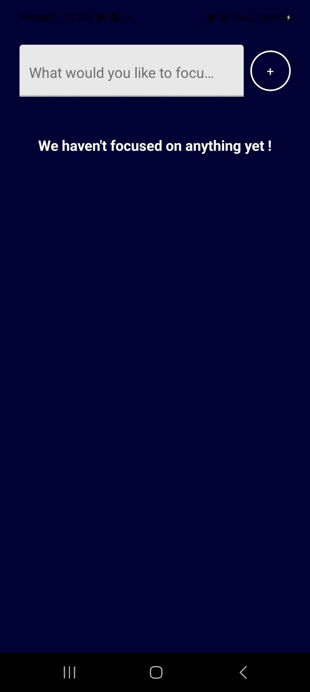
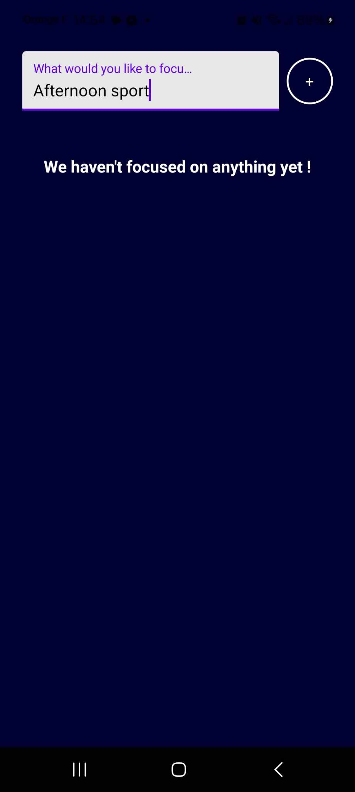
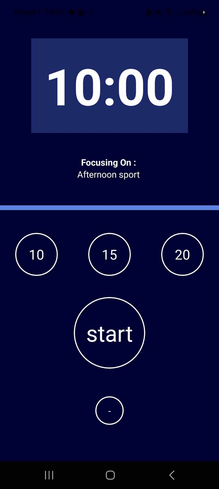
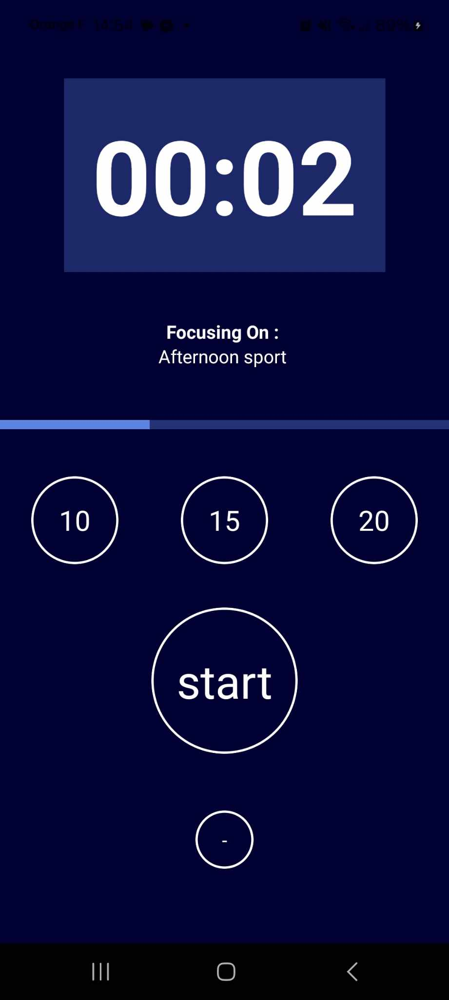
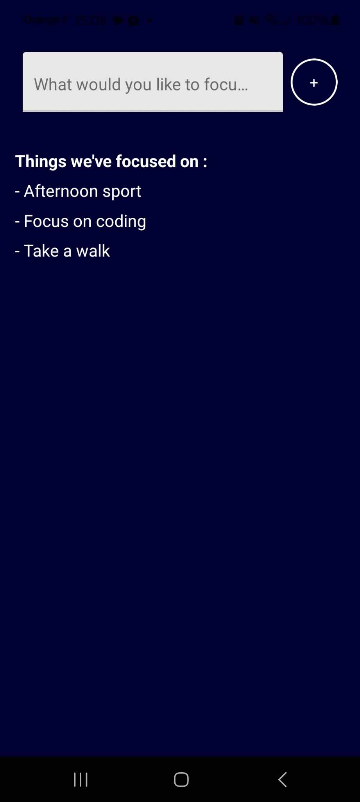

# ⏰ FocusTime

**FocusTime** is a minimalist timer app built with React Native, designed to help you stay focused on your important tasks.

## 📝 Features

- **Add a Task**: Specify the task you want to focus on.
- **Choose Your Focus Time**: Select a timer of 10, 15, or 20 minutes to stay concentrated.
- **Vibration Alert**: The app vibrates when the timer ends, indicating it's time to take a break or switch tasks.
- **Return to Previous Screen**: Click the "-" button to go back to the previous screen.
- **Task History**: View a history of completed tasks. Only tasks completed when the timer runs out are added to the history.

## 🚀 Getting Started

Follow these steps to get the app running locally:

1. **Clone the repository:**

   ```bash
   git clone https://github.com/Lydoww/FocusTime.git
   cd FocusTime

2. **start the app:**
   
   ```bash
   npm install
   npm start

3. **Focus Time**

## 📱 Screenshots

Here are some screenshots of the **FocusTime** app:

<div style="display: flex; justify-content: space-between;">

  
  
  

</div>
### Progress Bar


### Check Your Tasks



---

✨ Enjoy staying focused and productive with **FocusTime**! ✨
